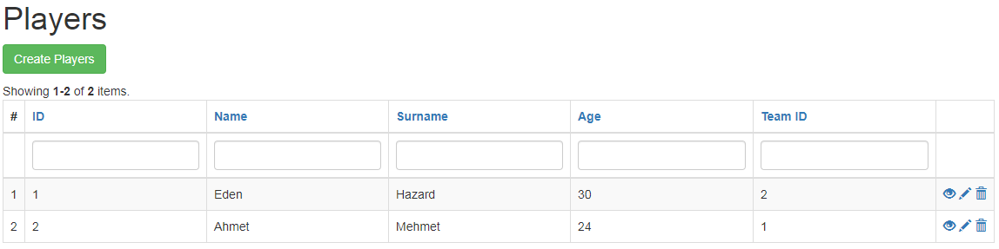
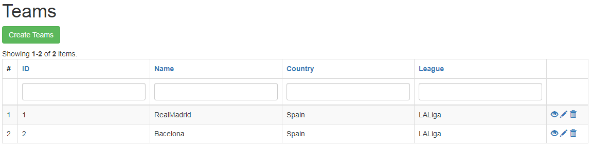
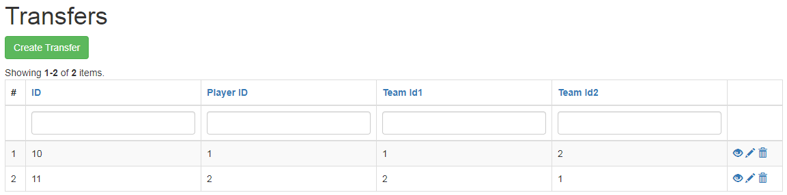

# yii2-130201092
Öncelikle bilgisayarınızda vagrant ve VM kurulu olmalıdır.
https://www.vagrantup.com/ ve https://www.oracle.com/tr/virtualization/virtualbox/ sitelerinden kurulum yapabilirsiniz.

Adım 1
yiisoft/yii2-app-advanced kurulumu.
konsola "cd /var/www/" yazdıktan sonra "composer create-project --prefer-dist yiisoft/yii2-app-advanced advanced" yazarak kurulumu gerçekleştiriyoruz.
Adım 2
Github linki ile clone çekme
konsola /var/www/advanced uzandıtında composer require --prefer-dist uguryildiz/yii2-content "dev-main"
Adım 3
advanced/backend/config/main.php içerisinde 'modules' -> 'content' altında 'players' => 'canberkdeniz95\players\module' yazmamız lazım.
Adım 4
moduledeki migrations dosyası içinde bulunan .php uzantılı dosyaları advanced/console/migrations ın içerisine kopyalayıp
konsolda "migrate up" komutunu çalıştırıyoruz.Böylelikle veri şemalarımız elde edilmiş oluyor.
Adım 5
"vagrant up" komutunu çalıştırarak makinemizi ayağa kaldırıp aşağıdaki görüntülere ulaşabiliyoruz.

Module Görüntüleri

1-http://advanced/backend/web/index.php?r=players/players/index linkinden oyuncuların tablosuna erişiyoruz.

2-http://advanced/backend/web/index.php?r=players/teams/index linkinden takımların tablosuna erişiyoruz.

3- ve son olarak http://advanced/backend/web/index.php?r=players%2Ftransfer%2Findex linkinden transfer işlemini gerçekleştirebiliyoruz.

4- Transfer işlemi oyuncunun hangi takımdan hangi takıma transfer olacağını ve bunun sonucunda oyuncunun takımının değişmesini sağlamaktadır.İşlem gerçekleştikten sonra tekrar http://advanced/backend/web/index.php?r=players/teams/index linkine giderek oyuncunun takımının değiştiği görülebilir.
